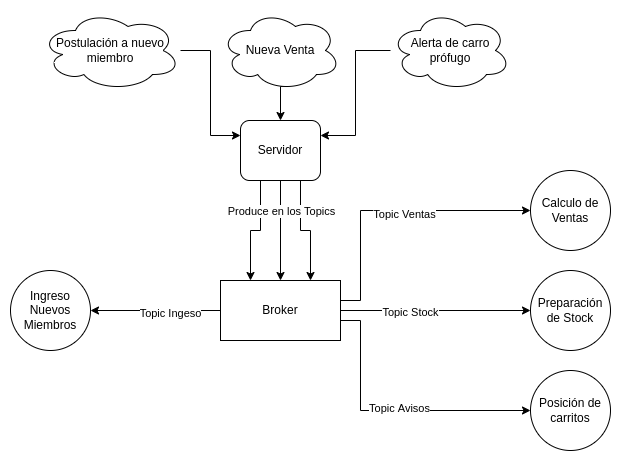
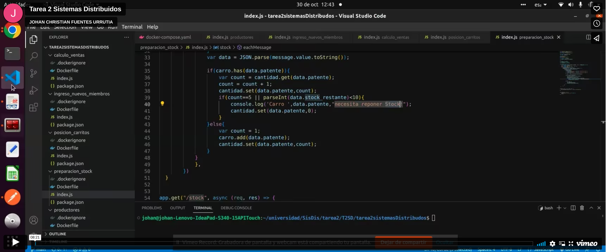

## Descripción del sistema

Sistema desarrollado en JavaScript, el cual nos permite gestionar los procesos internos del gremio sopaipillero de Chile a través de Apache Kafka, la cual es una plataforma distribuida de transmisión de datos que permite publicar, almacenar y procesar flujos de registros, así como suscribirse a ellos, de forma inmediata. Está diseñada para administrar los flujos de datos de varias fuentes y distribuirlos a diversos usuarios. En este repositorio tendremos el código y las instrucciones para ejecutar el sistema, para efectos de nuestro proyecto utilizaremos nodejs y docker para lograr los objetivos. Cabe mencionar que la estructura de este sistema fue obtenida del siguiente repositorio https://github.com/Oscurt/sdt2_2022_01, [Repositorio](https://github.com/Oscurt/sdt2_2022_01)

La arquitectura del Sistema se pueden resumir en la siguiente imagen:



### Enlace del vídeo del funcionamiento del Sistema

[](https://player.vimeo.com/video/765446652?h=408acc6a86&amp;badge=0&amp;autopause=0&amp;player_id=0&amp;app_id=58479)

## Dependencias

- [nodejs](https://nodejs.org/es/download/package-manager/)
- [npm](https://docs.npmjs.com/downloading-and-installing-node-js-and-npm)
- [zookeeper](https://zookeeper.apache.org/releases.html)
- [kafka](https://kafka.apache.org/downloads)
- [docker](https://docs.docker.com/engine/install/)
- [docker-compose](https://docs.docker.com/compose/install/)
- [zookeeper (docker)](https://hub.docker.com/r/bitnami/zookeeper)
- [kafka (docker)](https://hub.docker.com/r/bitnami/kafka)


## Ejecutar

Ejecutamos con

```sh
    docker-compose up --build # Se recomienda quitar --build si no se desea rebuilder.
```

## Rutas Post

### :3000/RegistroMiembro
Método http que ingresa una orden de agregar a un miembro, recibe un body:

Ejemplo:

```json
{
    "nombre":"juan", 
    "apellido":"valdes",
    "rut":"92345678-9",
    "correo":"juan@juan",
    "patente":"2",
    "premium": false
}
```
Si el usuario es premium se envía por la partición 1 del topic "ingreso", si no es premium se ingresa por la partición 0 del topic "ingreso". Si es premium el proceso de validarlo y registrarlo es más rápido. Cabe destacar que si un miembro quiere registrar un carro que ya fue registrado, la petición será rechazada.

### :3000/RegistroVenta
Método http que ingresa una venta, recibe un body:

Ejemplo:

```json
{   
    "patente":"2",
    "cliente":"Juan", 
    "cantidad_sopaipillas":"2",
    "stock_restante":"2",
    "coordenadas":"2,0,1" 
}
```
Este registro de venta se envia a los topic:
1. ventas: el cual crea estadísticas "una vez al día", con estos registros. Los datos se envían de manera balanceada a ambas particiones del topic (0 y 1), de manera de balancear cargas, esto se hace a través del método Round Robin.
2. stock: el cual analiza el stock de cada carro, bajo 2 condiciones se mandan alertas, la primera es si el stock está por debajo de cierta cantidad o si las ventas que haga son mayores a 5. Los datos se envían de manera balanceada a ambas particiones del topic (0 y 1), de manera de balancear cargas, esto se hace a través del método Round Robin.
3. avisos: el cual analiza la posición de cada carro (coordenadas enviadas a través de una venta) y la muestra por pantalla, en el caso de que un carro no envíe sus coordenadas dentro de un minuto, ya no se imprimirán más sus coordenadas por pantalla. Los datos son enviados a la partición 0 del topic, por esta partición se envían las coordenadas de los carritos que NO están fugados.

Cabe mencionar que el atributo "hora", se manda automáticamente en tiempo real, al realizar la petición post.

### :3000/AvisoAgenteExt
Método http que ingresa la patente y coordenadas de un carrito en fuga, recibe un body:

Ejemplo:

```json
{   
    "patente":"1",
    "coordenadas":"2,2,7" 
}
```
Estos datos se envían al topic "avisos", a la partición 1 del topic. A través de esta partición se alerta la presencia de un carrito en fuga, esta alerta se muestra por pantalla, mostrando la patente y coordenadas del carrito. 
